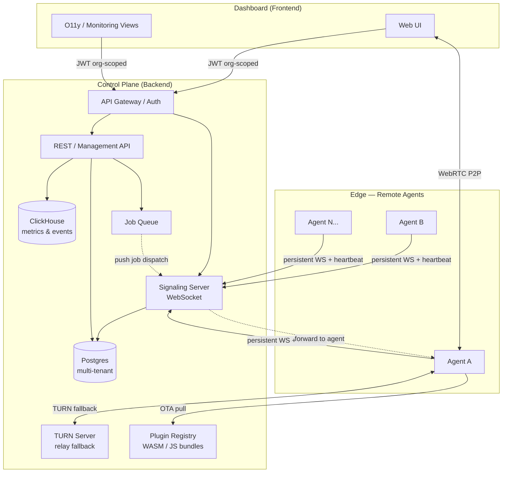
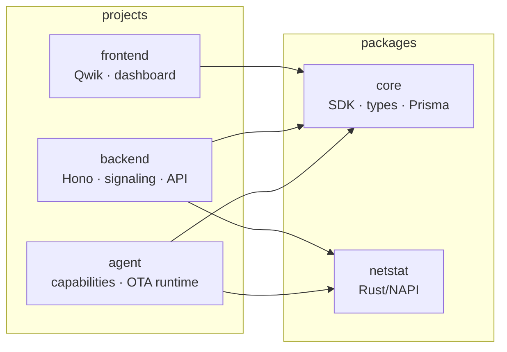
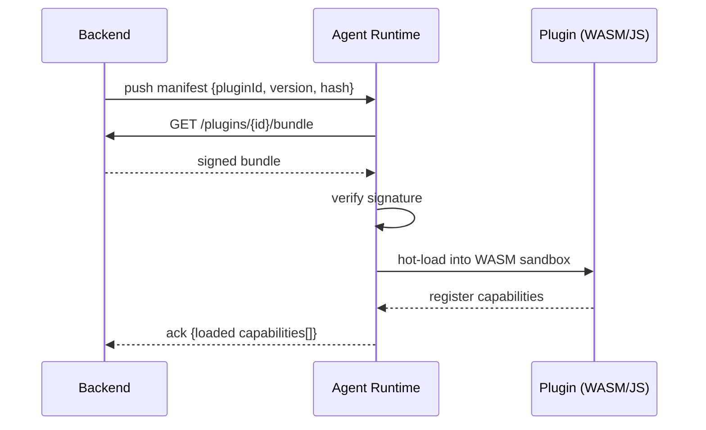
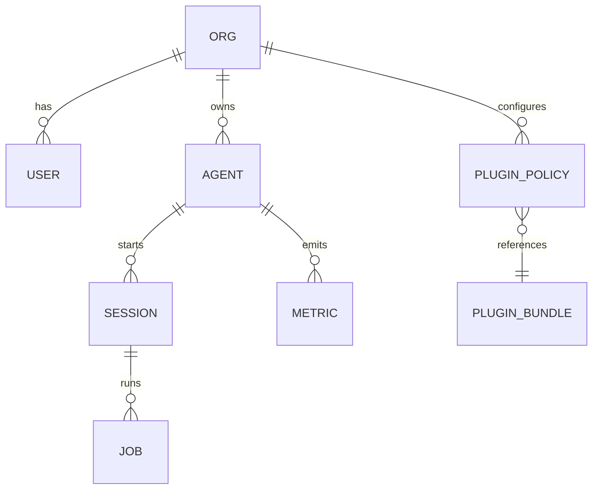

# Architecture

Avocado is a **remote access center** — a platform for monitoring, controlling, and
managing computer assets across an organization. This document describes the high-level
system architecture. For deeper design rationale, see [docs/design-docs/](./docs/design-docs/).

---

## System Overview



---

## Package Structure



**Dependency rule:** `projects/` depend on `packages/`; packages never depend on projects.
`packages/core` is the only place for shared types, schemas, and invariants.

---

## Session Connection Flow

```mermaid
sequenceDiagram
    participant Op as Operator (Browser)
    participant BE as Backend / Signaling
    participant Ag as Agent

    Ag->>BE: register + heartbeat (persistent WebSocket)
    Op->>BE: initiate session (REST)
    BE->>Ag: signal offer (via WS)
    Ag-->>BE: signal answer + ICE candidates
    BE-->>Op: relay SDP / ICE
    Op<-->Ag: WebRTC DataChannel / Media (P2P)
    Note over Op,Ag: Automatically falls back to TURN relay if P2P blocked
```

All capability traffic (screen share, file transfer, remote shell, background jobs)
multiplexes over a single WebRTC transport per session.

---

## OTA Plugin Lifecycle



Plugins run inside a WASM sandbox with a **capability-based permission model** —
each plugin declares the syscalls it needs; the agent enforces the allowlist.
No restart required for a plugin update.

---

## Multi-Tenant Data Model



---

## Key Technology Decisions

| Concern | Decision | Rationale |
|---|---|---|
| Agent ↔ Backend | Persistent WebSocket | Low-latency heartbeat, instant job dispatch |
| Operator ↔ Agent data | WebRTC P2P + TURN fallback | Low latency; works behind NAT |
| Metrics storage | ClickHouse | Column-store; fast range aggregations |
| OTA mechanism | WASM/JS plugin bundles | Hot-load without restart; sandboxable |
| Plugin isolation | WASM capability-based sandbox | Per-plugin syscall allowlist |
| Job triggers | Ad-hoc + scheduled + event-driven | Full operator flexibility |
| Auth model | Multi-tenant, org-scoped JWT roles | SaaS and self-hosted compatible |
| Self-hosted distribution | Docker Compose | Low ops burden for single-org deployments |

---

## Deployment Models

**SaaS** — Avocado operates the control plane. Agents point to `cloud.avocado.dev`.
Orgs are isolated at the DB row level (org-scoped JWT, row-level security).

**Self-hosted** — A Docker Compose stack ships backend + Postgres + ClickHouse + TURN.
Agents point to the operator's own host. No data leaves the org's network.

Both models share identical agent binaries and plugin bundles.

