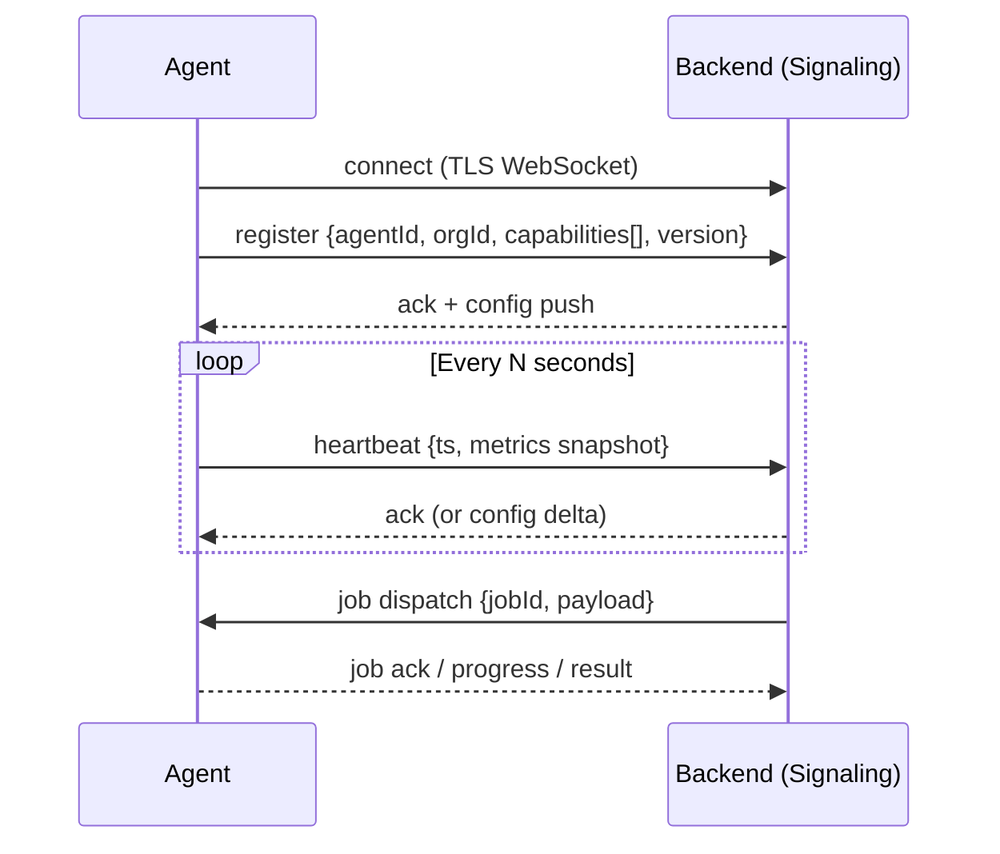
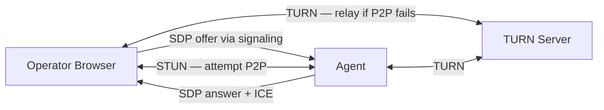

# Connectivity Design

Status: **Active**

How agents connect to the backend and to operators. This is the load-bearing layer
of the entire platform — see [core-beliefs.md](./core-beliefs.md) §1.

---

## Two Distinct Channels

| Channel | Protocol | Purpose |
|---|---|---|
| Control channel | WebSocket (persistent) | Heartbeat, signaling, job dispatch, telemetry |
| Data channel | WebRTC DataChannel / Media | Screen, file transfer, shell, audio/video |

These are kept separate intentionally: the control channel must always be alive even
when no session is active, while the data channel is ephemeral per-session.

---

## Control Channel

**Reconnection policy:** Agents reconnect with exponential backoff (base 1s, cap 60s,
jitter ±20%). The agent is considered "offline" after 3 missed heartbeat windows.

## Data Channel (WebRTC)

**ICE strategy:** STUN first; if no P2P path is found within the ICE timeout,
automatically relay via TURN. The same `RTCPeerConnection` is reused for all
capability traffic within a session (multiplexed `RTCDataChannel` streams).

### DataChannel Stream Allocation

| Label | Content | Ordered | Reliable |
|---|---|---|---|
| `ctrl` | Session control messages | Yes | Yes |
| `screen` | Encoded screen frames | No | No (latency priority) |
| `files` | File transfer chunks | Yes | Yes |
| `shell` | Terminal I/O | Yes | Yes |

---

## Security

- All WebSocket connections are TLS. No plaintext fallback.
- Agent identity is established at registration with a short-lived JWT issued by the
  backend after an enrollment token exchange. The enrollment token is a one-time secret
  provisioned by an admin.
- WebRTC DTLS-SRTP is mandatory. No unencrypted data channels.
- The TURN server authenticates via HMAC-SHA1 time-limited credentials (RFC 8489 §9.2).
  Credentials are issued by the backend and are scoped to a single session.

---

## Open Questions

- [ ] Maximum concurrent sessions per agent (resource limits)
- [ ] Whether to support UDP-only agents (no WebSocket — pure QUIC alternative)
