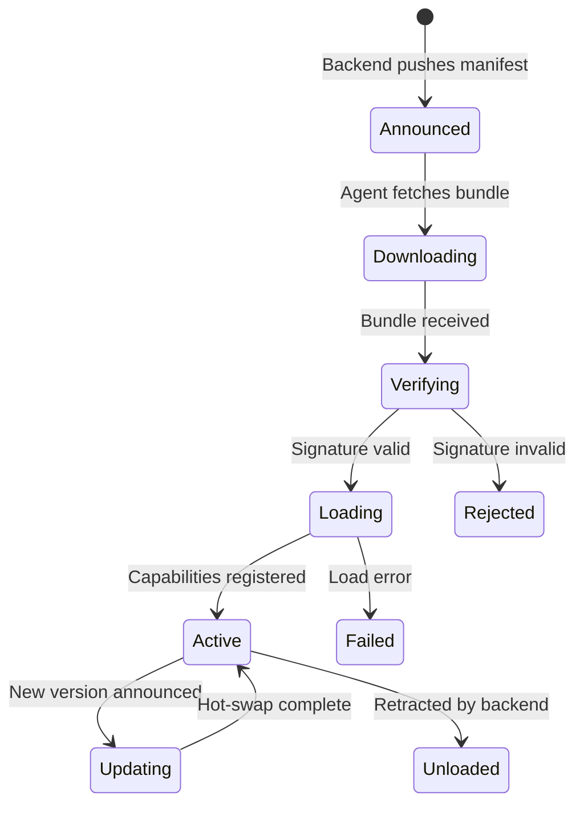
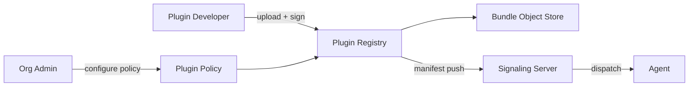

# OTA Plugin System Design

Status: **Active**

How new capabilities are delivered to agents at runtime without a binary update or restart.

---

## Goals

- Ship new monitoring sensors, remote actions, and integrations to all agents in an org
  without touching the agent binary.
- Each plugin is isolated — a buggy or compromised plugin cannot affect the agent core
  or other plugins.
- Rollouts are per-org and staged; a bad plugin can be retracted without affecting other orgs.

---

## Plugin Bundle Format

A plugin bundle is a signed archive containing:

```
plugin.wasm          # compiled WASM module (main entrypoint)
plugin.js            # optional JS glue for Web APIs not available in WASM
manifest.json        # metadata, declared permissions, API version
```

**`manifest.json` schema:**

```json
{
  "id": "com.avocado.monitor.gpu",
  "version": "1.2.0",
  "apiVersion": "1",
  "capabilities": ["metrics.emit"],
  "permissions": {
    "syscalls": ["clock_gettime", "read"],
    "fs": [{ "path": "/sys/class/drm", "access": "read" }],
    "network": []
  }
}
```

The `permissions` block is the **declared capability set**. The agent enforces it —
any syscall or resource access not listed causes the plugin to be terminated.

---

## Lifecycle



---

## Sandbox Model

Each plugin runs in its own WASM instance inside the agent process. The agent
implements a **WASI-based host** with a capability allowlist derived from the manifest:

```
Agent Process
├── Agent Core (full trust)
├── Plugin Runtime Host
│   ├── Plugin A (WASM sandbox, allowlist A)
│   └── Plugin B (WASM sandbox, allowlist B)
└── netstat native addon (full trust, Rust)
```

Plugins communicate with the agent core through a narrow **message-passing API** —
they cannot call agent internals directly. The API is versioned; `manifest.apiVersion`
determines which API surface is exposed.

---

## Plugin Registry (Backend)



**Plugin Policy** is configured per-org and specifies:
- Which plugin IDs are enabled
- Which version constraint is allowed (e.g., `^1.0.0`)
- Agent target groups (e.g., `tag:windows` or `*`)

---

## Code Signing

Bundles are signed with an Ed25519 key pair. The backend holds the **signing key**
(never stored on agents). Agents are provisioned with the **verification key** at
enrollment. Bundles with invalid signatures are rejected before loading — not logged
and retried.

---

## Open Questions

- [ ] Whether to support JS-only plugins (no WASM) for lighter-weight use cases
- [ ] Plugin-to-plugin communication model (currently: none; plugins are isolated)
- [ ] Developer toolchain for building and locally testing plugins
